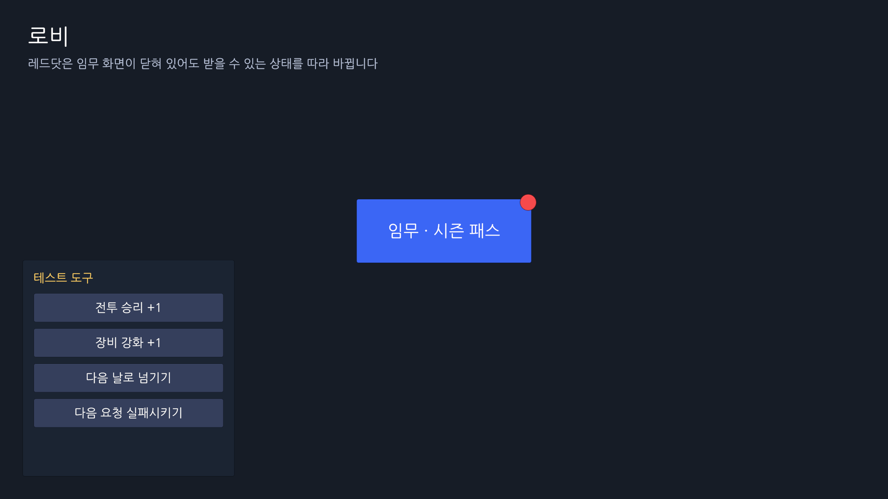
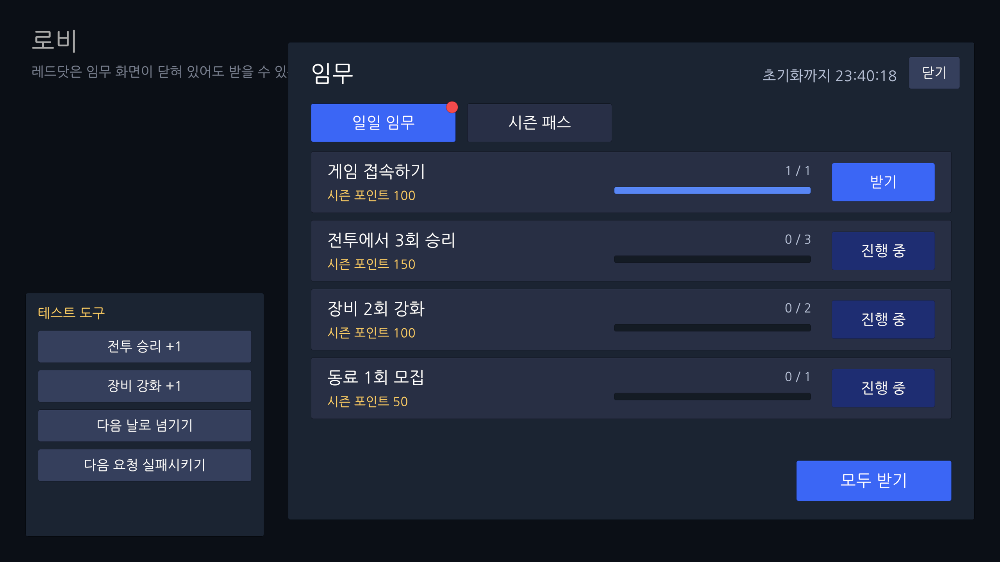
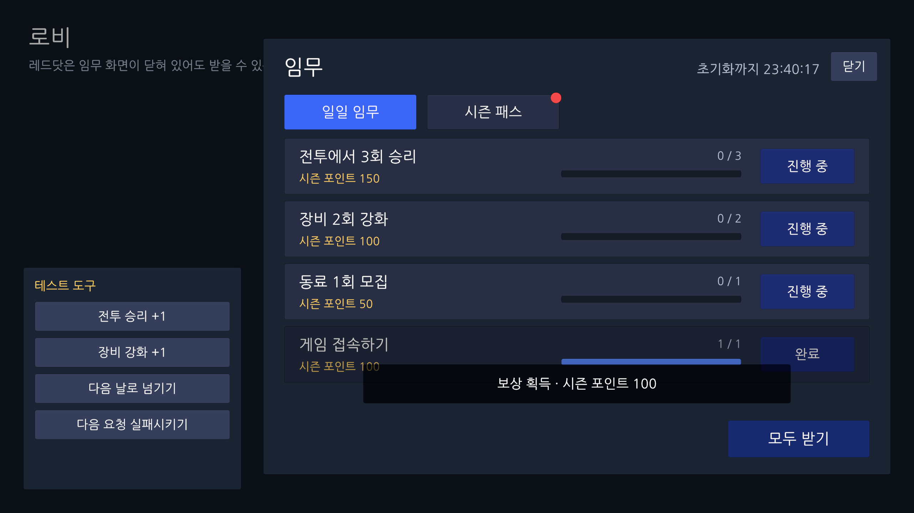
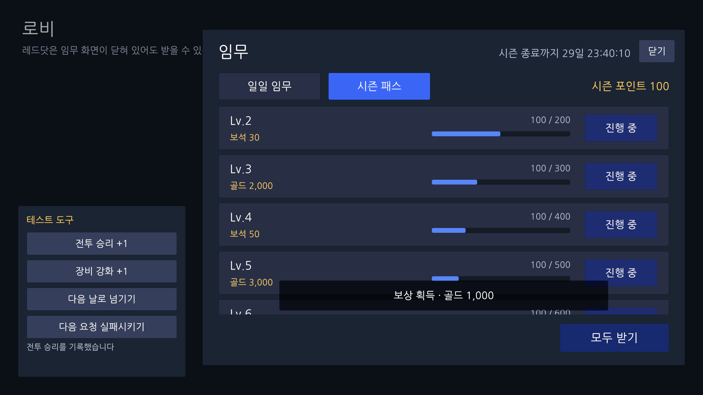
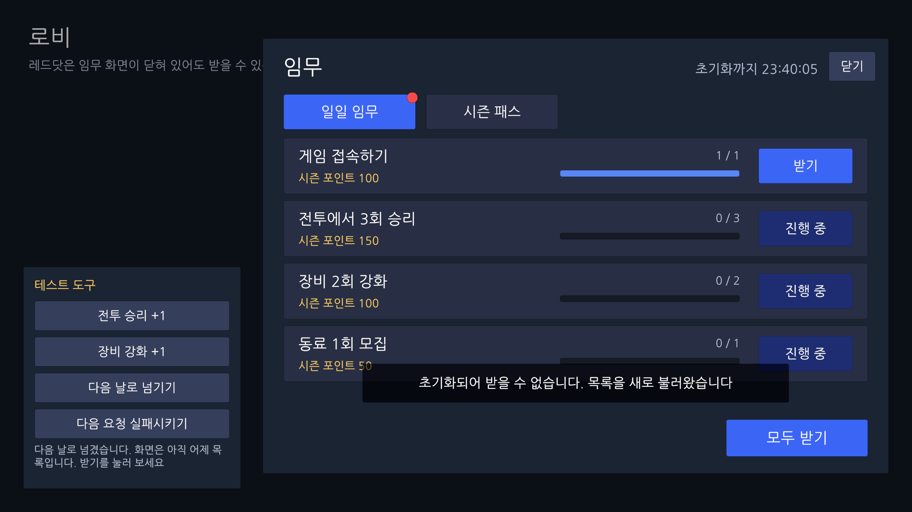
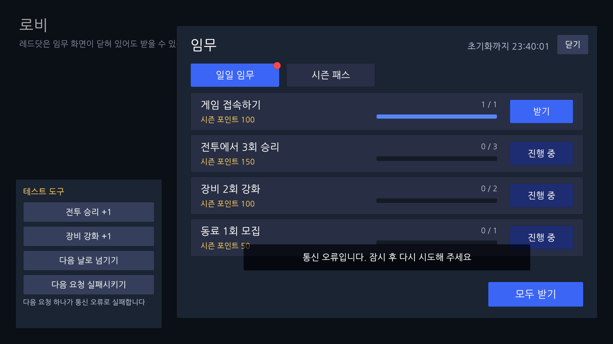

# 임무 · 시즌 패스 UI (Unity · MVP)

일일 임무와 시즌 패스 화면을 MVP로 만든 UI 샘플입니다. 통신 없이 실행되고, 응답 지연(기본 0.4초)을 넣어 연타 · 요청 중 화면 닫기 · 통신 실패 같은 상황을 시험할 수 있습니다.

Unity 6000.6 · uGUI · R3 · VContainer · UniTask · EditMode 테스트 51개

| 로비 | 임무 | 받기 |
| --- | --- | --- |
|  |  |  |
| **시즌 패스 모두 받기** | **초기화가 지난 목록으로 받기** | **통신 오류** |
|  |  |  |

## 핵심 설계

- **퀘스트 하나로 정형화** — 일일 임무와 시즌 패스 단계는 같은 흐름(진행 중 → 받기 가능 → 받음)이라, 받기 규칙 · 레드닷 · 목록 셀을 한 벌만 둡니다.
- **판단은 한 곳** — 받을 수 있는지는 `QuestRules`만 정합니다. 레드닷 세 곳과 받기 버튼이 서로 어긋날 수 없습니다.
- **상태는 응답이 정함** — 클라이언트가 먼저 하는 일은 초기화 하나이고, 다음 응답이 덮어씁니다. 초기화 뒤에는 0~60초 사이 무작위로 늦춰 목록을 한 번 다시 받아, 클라가 모르는 서버 규칙(접속하면 접속 임무 완료 등)으로 바로잡습니다. 받은 목록의 서버 시각이 아직 그 초기화 전이면(기기 시계가 빠름, 초기화 직전 요청의 늦은 응답) 서버가 초기화를 넘긴 뒤 한 번 더 받습니다. 그 밖에는 버튼 없이 서버에 묻지 않습니다.
- **요청은 한 번에 하나** — 진행 중인 요청은 앱 수명인 Store가 들고 있습니다. 연타는 물론, 요청 중에 화면을 닫았다 다시 열어도 두 번째 요청이 나가지 않습니다. 화면은 `IsRequesting`을 보고 입력을 버립니다.
- **늦게 온 응답은 버림** — 스냅샷마다 서버 리비전이 있어, 순서가 뒤집혀 도착한 옛 응답이 최신 상태를 덮지 않습니다.
- **실패하면 간격을 늘려 다시** — 목록 받기가 실패하면 1초부터 두 배씩 최대 30초 간격으로(50~100% 지터) 다시 받고, 기다릴 시간을 알립니다.
- **오류는 한 종류로** — 서버 거절과 전송 오류(타임아웃 · 연결 끊김)를 Store 경계에서 `QuestServerException` 하나로 맞춥니다. 그 밖의 예외(코드의 실수)는 통신 오류로 덮지 않고 그대로 올립니다. 화면은 이유에 맞는 문구만 고릅니다.
- **실패한 받기 뒤에는 목록을 맞춤** — 서버가 거절하면(이미 받음 · 조건 미달 · 초기화가 지난 목록) 바로 새로 받고, 통신 오류면 서버가 처리하고 응답만 잃었을 수 있어 다음 틱에 다시 받습니다. 같은 버튼을 다시 눌러 '이미 받음'을 보게 두지 않습니다.
- **Presenter는 연결만, View는 넣기만** — 계산은 Store와 순수 함수(`QuestRules` · `QuestFormatter`)에 있어 씬 없이 테스트합니다.
- **바뀔 때만 그림** — 레드닷 같은 값은 같으면 알리지 않고(`ReadOnlyReactiveProperty`), 목록은 매번 새 배열로 오지만 셀이 `record` 값 비교로 같은 행을 건너뜁니다.
- **받기는 화면과 따로** — 요청이 이미 처리됐을 수 있어 화면을 닫아도 응답은 반영합니다.
- **모두 받기는 Id 배열** — 받을 수 있는 Id만 골라 보내고, 그중 검증을 통과한 것만 지급됩니다.

## 시간

- 시간 값은 `UnixTime`(시점) · `UnixSpan`(길이) 두 타입만 씁니다(`QuestSample.Timing`). `DateTime`은 `Time` 폴더 안(변환 · 월 계산)에만 있고, `TimeSpan`으로는 R3 · UniTask 타이머에 넘길 때만 바꿉니다.
- 지금은 [`UnixTime.Now`](Assets/QuestSample/Runtime/Time/UnixTime.cs#L21-L27) 한 곳에서 읽고, 뒤에 `TimeProvider`가 있어 테스트에서는 시각을 직접 움직입니다. 값 타입 어디서든 같은 "지금"을 쓰려고 정적으로 두었고, 테스트는 끝날 때 원래 값으로 되돌립니다.
- 기기 시각은 보정하지 않습니다. 받을 수 있는지는 서버가 판정합니다. 시계가 빠른 기기는 초기화를 일찍 하지만, 0~60초 뒤 다시 받은 목록의 서버 시각이 아직 초기화 전이면 서버가 그 시각을 넘긴 뒤 한 번 더 받아 맞춥니다. 남은 시간 표시는 기기 시계를 따릅니다(보정이 필요하면 응답의 `ServerTime`으로 오프셋을 잡는 `TimeProvider`로 바꾸면 됩니다).
- 틱은 [`Clock100ms`](Assets/QuestSample/Runtime/Time/Clock100ms.cs) 하나이고, 초기화 감시(`ResetWatcher`) · 다시 받기 예약 · 남은 시간 표시가 구독합니다. 구독자 하나가 예외를 던져도 나머지는 받습니다.
- 초기화는 일간(매일 10시)과 월간(매월 1일 10시, 시즌 패스) 두 가지입니다. 주간 콘텐츠가 없어 주간 일정은 두지 않았습니다.

## 5분 안에 볼 곳

화면에서 안쪽으로 들어가는 순서입니다. 링크를 누르면 해당 줄이 열립니다.

| | 볼 곳 | 볼 점 |
| --- | --- | --- |
| 1 | [`QuestScreenPresenter.Initialize`](Assets/QuestSample/Runtime/Presentation/QuestScreen/QuestScreenPresenter.cs#L36-L84) | 화면 연결 전부. 받기는 [응답 전 입력을 버리고, 앞선 요청이 진행 중이면 보내지 않으며](Assets/QuestSample/Runtime/Presentation/QuestScreen/QuestScreenPresenter.cs#L69-L76), 남은 시간은 [보이는 초가 바뀔 때만](Assets/QuestSample/Runtime/Presentation/QuestScreen/QuestScreenPresenter.cs#L60-L67) 그림 |
| 2 | [`QuestStore`](Assets/QuestSample/Runtime/Store/QuestStore.cs#L45-L74) | 레드닷은 `QuestRules`로 만든 파생 값. [요청은 한 번에 하나](Assets/QuestSample/Runtime/Store/QuestStore.cs#L147-L181), 응답은 [`Accept`](Assets/QuestSample/Runtime/Store/QuestStore.cs#L276-L304) 한 곳으로만(옛 리비전은 버리고, 서버 시각이 초기화 전이면 다시 받기 예약), 클라이언트가 먼저 하는 건 [초기화와 다시 받기 예약](Assets/QuestSample/Runtime/Store/QuestStore.cs#L306-L328)뿐 |
| 3 | [`RefreshScheduledAsync`](Assets/QuestSample/Runtime/Store/QuestStore.cs#L221-L242) · [`RetryDelay`](Assets/QuestSample/Runtime/Store/QuestStoreOptions.cs#L29-L47) · [`Send`](Assets/QuestSample/Runtime/Store/QuestStore.cs#L253-L274) · [`ReceiveCoreAsync`](Assets/QuestSample/Runtime/Store/QuestStore.cs#L183-L214) | 실패하면 1 → 2 → 4 … 30초(지터). 전송 오류만 경계에서 통신 오류로 바꿈. 받기가 실패하면 목록을 서버 상태로 맞춤 |
| 4 | [`QuestBoard.QuestsOf`](Assets/QuestSample/Runtime/Domain/QuestBoard.cs#L72-L99) · [`QuestRules`](Assets/QuestSample/Runtime/Domain/QuestRules.cs) | 두 콘텐츠가 같은 `Quest`가 되는 곳. 시즌 패스 단계는 [시즌 포인트가 진행도](Assets/QuestSample/Runtime/Domain/PassTier.cs#L9-L12) |
| 5 | [`ResetWatcher.Check`](Assets/QuestSample/Runtime/Time/ResetWatcher.cs#L96-L117) | "10시인가"가 아니라 "초기화 시각을 넘었는가"를 봄. 일간 · 월간이 겹쳐도 한 신호, 받는 쪽 하나가 [예외를 던져도 나머지는 받음](Assets/QuestSample/Runtime/Time/ResetWatcher.cs#L119-L147) |
| 6 | [`QuestStoreTests`](Assets/QuestSample/Tests/QuestStoreTests.cs) | 테스트 이름이 명세. 예: [`진행_중인_요청이_있으면_화면을_다시_열어도_두번째_요청을_보내지_않는다`](Assets/QuestSample/Tests/QuestStoreTests.cs#L331-L349), [`늦게_도착한_옛_스냅샷은_무시한다`](Assets/QuestSample/Tests/QuestStoreTests.cs#L351-L363), [`서버가_처리한_뒤_응답이_유실되면_다음_틱에_목록을_다시_받아_바로잡는다`](Assets/QuestSample/Tests/QuestStoreTests.cs#L427-L443), [`기기_시계가_5분_빠르면_서버가_초기화를_넘긴_뒤_목록을_다시_받는다`](Assets/QuestSample/Tests/QuestStoreTests.cs#L445-L468) |

**다룬 경우**: 받기 연타, 요청 중 화면을 닫았다 다시 열기, 늦게 도착한 옛 응답, 요청 거절, 전송 오류(타임아웃), 받기 응답 유실(서버는 처리), 다른 기기에서 먼저 받음, 초기화가 지난 목록으로 받기, 모두 받기에 받을 수 없는 것이 섞임, 화면을 닫아 둔 채 초기화, 초기화 뒤 서버 규칙으로 바로잡기, 초기화 직전 요청의 늦은 응답, 기기 시계가 빠름(5분 · 25시간), 첫 목록 받기 실패(백오프), 화면을 연 첫 프레임, 시즌 종료, 일시정지

## 설계 결정

| 결정 | 이유 | 대가 · 대안 |
| --- | --- | --- |
| 초기화 시각에 서버에 바로 묻지 않고, 클라가 먼저 되돌린 뒤 0~60초 뒤 한 번 다시 받는다 | 모든 기기가 10:00:00에 한꺼번에 묻는 것을 피하면서, 접속 임무 같은 서버 규칙을 1분 안에 화면에 반영한다 | 최대 60초 동안 접속 임무 레드닷이 꺼져 있다. 서버가 푸시를 줄 수 있다면 그쪽이 낫다 |
| 요청은 Store에서 한 번에 하나 | 화면 수명과 상관없이 중복 요청과 응답 역전을 한곳에서 막는다 | 진행 중에 들어온 입력은 버려진다(사용자가 다시 누른다). 대안은 요청 큐 |
| 응답에 리비전을 두고 옛 스냅샷은 버린다 | 요청을 하나로 묶어도 재시도 · 새로 받기가 겹칠 수 있어 마지막 방어선으로 둔다 | 서버가 리비전을 내려 줘야 한다 |
| 기기 시각은 보정하지 않는다 | 판정은 서버가 하고, 화면은 다시 받기로 바로잡힌다. 받은 목록이 아직 초기화 전(서버 시각)이면 서버가 넘긴 뒤 한 번 더 받는다 | 시계가 빠른 만큼 초기화가 일찍 보였다가 서버 목록으로 돌아간다. 카운트다운도 기기 시계를 따른다. 대안은 `ServerTime` 오프셋 `TimeProvider` |
| 받기가 통신 오류로 끝나면 다음 틱에 목록을 다시 받는다 | 서버가 처리하고 응답만 잃었을 수 있다. 같은 버튼을 다시 눌러 '이미 받음'을 보게 두지 않는다 | 연결이 끊긴 동안은 백오프로 다시 시도한다. 실서버라면 받기 요청에 멱등 키를 붙여 같은 요청이 두 번 와도 한 번만 처리되게 하는 편이 낫다 |
| 화면 값은 `IInitializable`에서 채운다(임무 화면 · 로비) | 프레임 도중에 만든 스코프에서 `IStartable.Start`는 다음 프레임에 불려, 첫 프레임에 프리팹 기본값이 비친다 | — |

## 실행

Unity 6000.6(6000.6.0f1)에서 `Assets/QuestSample/Scenes/QuestSample.unity`를 열고 Play. 테스트는 `Window > General > Test Runner > EditMode`.
응답 지연은 씬의 `AppLifetimeScope` 인스펙터 **테스트: 응답 지연**(기본 0.4초)에서 바꿉니다. 왼쪽 아래 테스트 도구로 아래 상황을 시험합니다.

1. 접속 임무 **받기** → 시즌 패스 탭에 레드닷
2. **다음 날로 넘기기** → 어제 목록으로 **받기** → 거절되고 새 목록
3. **다음 요청 실패시키기** → **받기** → 통신 오류, 목록은 그대로

씬에는 [UI Rebuild Tracker](https://github.com/Syerin/UNITY-UGUI-REBUILD-TRACKER)가 들어 있어, 받기를 누를 때 다시 그려지는 UI가 표시됩니다. 레이아웃 루트에는 `LAYOUT`, 그 안의 원인 후보에는 `CAUSE`가 붙습니다(`Assets/UIRebuildTracker`는 패키지 1.2.0의 사본입니다).

## AI 사용

이 샘플은 AI(Claude)와 설계를 논의하며 만들었습니다. 무엇을 보여 줄지(퀘스트 정형화)와 패턴(MVP), 라이브러리 구성(R3 · VContainer · UniTask)은 제가 정했고, 코드 작성은 Claude Code(데스크톱)로 진행했습니다. 작업할 때 Unity 에디터는 [MCP for Unity](https://github.com/CoplayDev/unity-mcp)로 연결했고, 샘플 실행에는 필요 없어 패키지 목록에서는 뺐습니다.

코드는 AI가 썼고, 저는 설계를 정하고 코드를 검토했습니다. 코드 리뷰를 받은 뒤 반영한 수정(요청 단일화, 리비전, 백오프, 초기화 뒤 다시 받기, 미사용 코드 정리, 스타일 통일)과, 두 번째 리뷰에서 시나리오 테스트로 재현된 빈틈 3개(기기 시계가 빠를 때, 초기화 직전 요청의 늦은 응답, 받기 응답 유실)의 수정도 Claude와 함께 했고, 해당 커밋에 `Co-Authored-By`로 남겼습니다. 바뀐 동작과 이전 동작은 테스트 51개로 함께 확인합니다.
